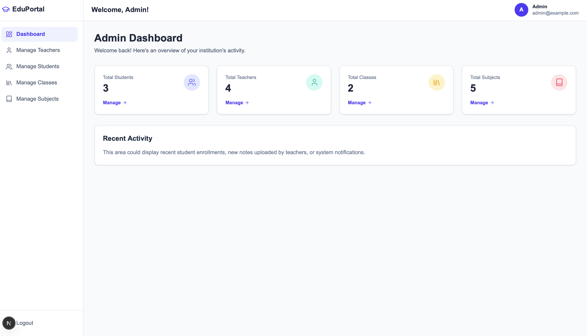
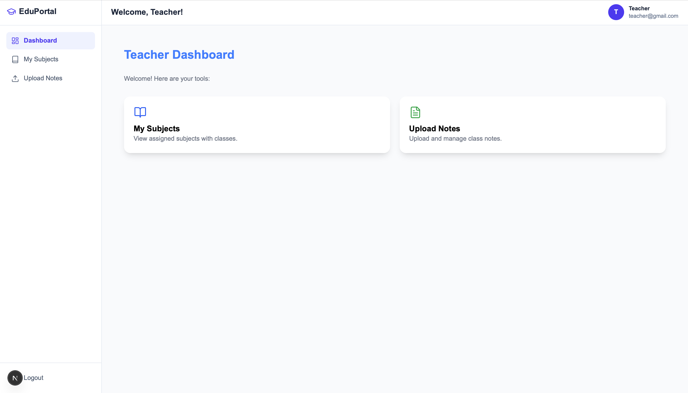
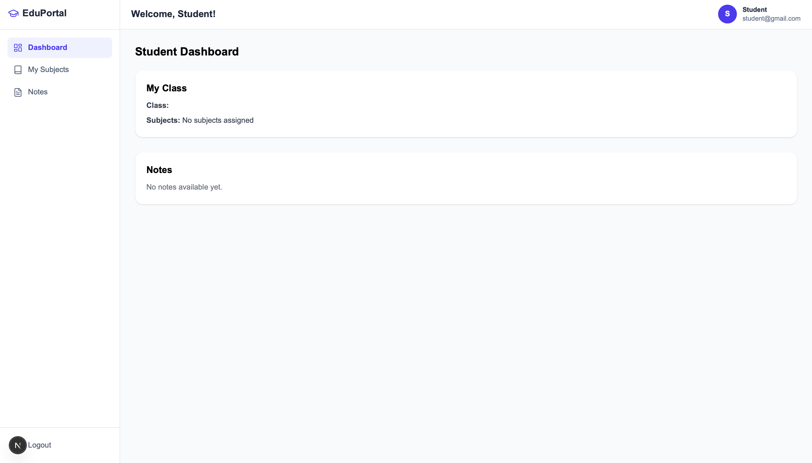

# 🎓 Tuition Portal

A modern multi-role tuition management system built with **Next.js (App Router)**, **MongoDB Atlas**, **NextAuth.js**, and **Tailwind CSS**.  
It provides separate dashboards and features for **Admins**, **Teachers**, and **Students**.

> 🚧 **Project Status: Ongoing Development**  
> This project is actively being built and new features are continuously added.

---

## 🚀 Features

### 👨‍💼 Admin
- Manage Teachers (add, view, delete)
- Manage Students (assign to classes)
- Manage Classes (create, view, delete)
- Manage Subjects (create, delete)
- Assign Teachers to Subjects in Classes
- Assign Students to Classes

### 👨‍🏫 Teacher
- View assigned Classes & Subjects
- Upload Notes (files, resources)
- Upload Marks as PDFs for entire classes
- Share resources with students

### 👨‍🎓 Student
- View Class & Subject details
- Access Notes uploaded by teachers
- View Marks (PDFs, reports)

---

## 🛠️ Tech Stack
- **Frontend:** [Next.js 14+ (App Router)](https://nextjs.org/), [React](https://react.dev/), [Tailwind CSS](https://tailwindcss.com/), [Framer Motion](https://www.framer.com/motion/)
- **Authentication:** [NextAuth.js](https://next-auth.js.org/)
- **Backend:** Next.js API Routes
- **Database:** [MongoDB Atlas](https://www.mongodb.com/atlas)
- **Storage:** Cloudinary (for files & notes)

---
Future Improvements

📊 Role-based analytics (charts & reports)

📅 Attendance management

💳 Online payments for tuition fees

🔔 Notifications & messaging

🎨 More UI enhancements

## 📸 Screenshots

